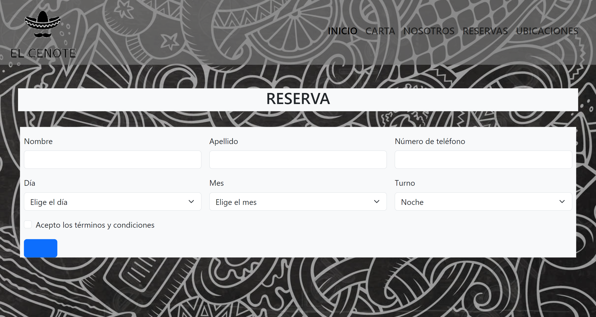

<h1 align="center"> EL CENOTE </H1>

---

1st in spanish :es: 2nd in english :gb:

1. Explicación del proyecto 
    - Fases del proyecto 
    - Fechas del proyecto 
    - Tecnologías utilizadas 
    - Como se ha hecho 
    - Problemas y dificultades del proyecto 

2. Resultado Final 

3. Agradecimientos 

4. Créditos 
--- 

**Explicación del proyecto** 

Este proyecto ha sido un proyecto académico que ha consistido en la realización de una página web para algún establecimiento de hostelería, en mi caso me he inventado el restaurante. 

El proyecto ha pasado por las fases de diseño, revisión, produccion de código, segunda revisión y revisión final.

    Este proyecto se ha llevado a cabo en 3 días 

---

**Tecnologías utilizadas** 

**Como se ha hecho** 

El proyecto se ha realizado al 80% con Bootstrap, así era como se mos había pedido. Lo que hice fue estructurar toda la página web en papel y después empecé a buscar en Bootstrap que se acercaba más a lo que yo quería. Fui adaptando las herramientas de Bootstrap hasta que el resultado final fue de mi agrado. 

**Problemas y dificultades** 

En este proyecto la mayor complejidad que he encontrado ha sido bootstrap, debido a que nunca había utilizado este framework y a la hora de intentar editar algunas características desde CSS3, los propios estilos de Bootstrap no me dejaban editar las cosas a mi gusto.

---

**2. RESULTADO FINAL** 

**Agradecimientos** 

Quería dar las gracias a mis compañeros de clase, ya que sin ellos este proyecto seguramente no se hubiese terminado. 